# 👋 Hi, I'm Mousoom Samanta

### AI Engineer • Software Developer • ML Researcher

  

  

  

  

---

# 🚀 About Me

- 🎓 B.Tech in Computer Science & Engineering
- 🤖 AI Engineer
- 💻 Full Stack Software Developer
- 🧠 Machine Learning Researcher
- 🌱 Open Source Contributor
- 🚀 Passionate about building impactful AI products

---

# 💼 Experience

- IIT Kharagpur — GRISHMA Summer Project Intern
- Infosys Springboard — Software Engineering Trainee
- Google Summer of Code — Open Source Contributor
- Atharvo India — Machine Learning Intern

---

# 🚀 Featured Projects

- 🧠 BODH-I
- 🍔 FoodOrder AI
- 🎯 PrepGrid
- 📦 Smart Inventory Management
- 🩺 Mano Veda
- 💼 Rancho's Platform

---

# 💻 Tech Stack

### Languages

### Frameworks

### AI / ML

TensorFlow • PyTorch • OpenCV • Scikit-Learn

### Database

MongoDB • MySQL

### Tools

Git • GitHub • Docker • Linux

---

# 📊 GitHub Analytics

---

# 🔥 GitHub Streak

---

# 📈 Contributions

---

### ⭐ Thanks for visiting ⭐

